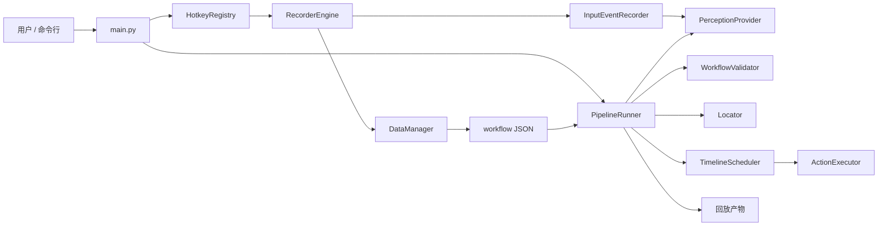
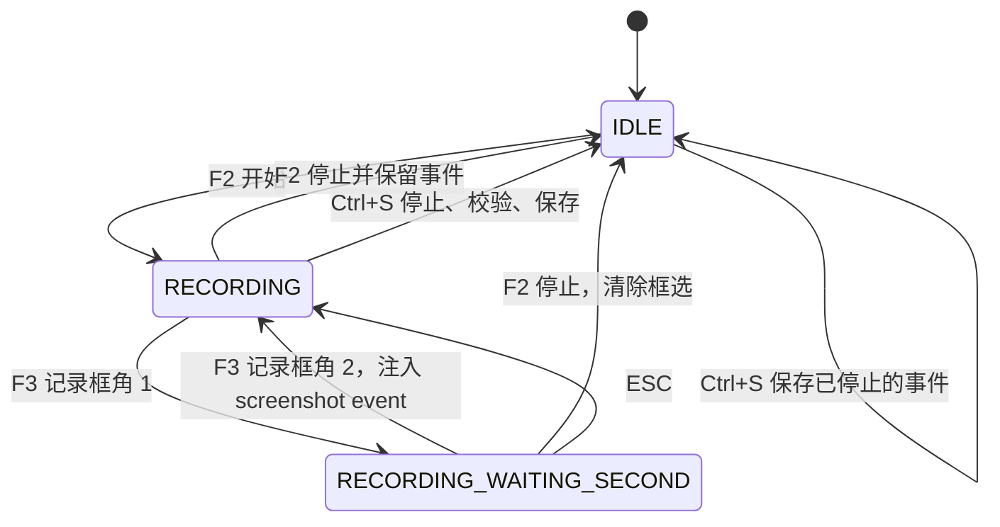
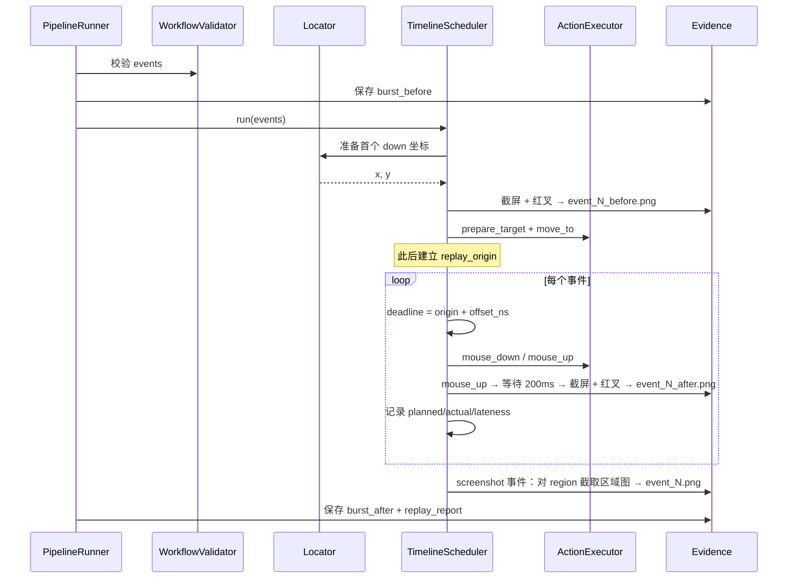

# RPA Snap Locate 架构

本文面向维护者，描述当前代码的真实结构与运行关系。项目提供两种工作流：默认的“时间线工作流”分别记录鼠标按下、抬起以及每个事件相对首个输入的时间，可保留点击持续时间、相邻操作间隔和快速双击；可选的“逐步点击工作流”只保存点击位置和执行顺序，适合不关心操作间隔的简单流程。

## 1. 系统边界

项目负责以下工作：

- 监听全局录制热键；
- 录制左键、右键和中键的按下/抬起事件；
- 保存事件时间、位置、按钮和定位信息；
- 校验工作流是否完整且顺序正确；
- 按录制时的时间线向 Windows 注入鼠标事件；
- 保存一次回放的前后快照和回放报告；
- 读取并运行只保存点击位置和顺序的逐步点击工作流。

当前不负责键盘按键时间线、鼠标移动轨迹、拖拽、滚轮、真正的图像匹配或 LLM 定位。键盘自动化与未来可能采用的视觉模型均通过 Command Series 调用外部工具，不进入本项目内核；界面变化检测和图像特征工具仍是预留模块。

## 2. 总体结构



核心关系是：

1. `RecorderEngine` 管理用户看到的录制状态，但不直接监听物理鼠标。
2. `InputEventRecorder` 负责尽快接收原始鼠标事件并给它们加时间。
3. `DataManager` 在写入时间线工作流前调用 `WorkflowValidator`，不允许把不完整事件保存成有效文件。
4. `PipelineRunner` 负责一次回放的完整生命周期，并把具体时间调度交给 `TimelineScheduler`。
5. `TimelineScheduler` 决定何时发送事件，`ActionExecutor` 只负责 Windows 窗口准备、鼠标移动和实际注入。

## 3. 分层与依赖方向

```text
main.py              组合入口：配置、热键、录制器、回放器
  ↓
engine/              流程编排：状态机、事件采集、校验、调度、回放
  ↓
core/                系统能力：屏幕/鼠标感知、坐标定位、Windows 输入
  ↓
config/ + utils/     配置与无状态工具

engine/ → data/      工作流持久化
data/   → engine/    仅 DataManager 调用 workflow_validator
```

大部分依赖由上向下。当前有一个明确的交叉点：`data/data_manager.py` 导入 `engine/workflow_validator.py`，以保证时间线事件在落盘前一定经过校验。若以后严格拆分层次，可把 schema/validator 移到独立的 domain 包；现阶段它是持久化边界的保护措施。

## 4. 目录与职责

```text
rpa_snap_locate/
├── main.py                         命令入口、热键回调、最新工作流回放
├── config/
│   ├── config_manager.py           YAML 单例配置读取
│   └── system.yaml                 屏幕、路径、录制与回放配置
├── engine/
│   ├── recorder_engine.py          时间线/逐步点击两套录制状态机
│   ├── input_event_recorder.py     鼠标钩子、单调时间、队列、事件转换
│   ├── workflow_validator.py       时间线结构、顺序和按下/抬起配对校验
│   ├── timeline_scheduler.py       绝对截止时间调度、迟到统计、安全释放
│   ├── pipeline_runner.py          两种工作流分发、定位、执行、回放产物
│   ├── step_builder.py             仅供逐步点击模式构造 click 步骤
│   └── hotkey_registry.py          keyboard 全局热键封装
├── core/
│   ├── perception_provider.py      截屏、鼠标、活动窗口、DPI 与分辨率
│   ├── action_executor.py          Windows 前台窗口、鼠标移动、SendInput
│   ├── locator_protocol.py         定位接口和工厂
│   └── locators/
│       └── fixed_locator.py        归一化坐标转当前物理坐标
├── data/
│   ├── data_manager.py             两种工作流 JSON 的保存与读取
│   ├── workflows/                  已保存工作流
│   └── recordings/                 每次回放的产物（快照、截图、报告）
├── utils/                          DPI、日志、哈希等工具
├── tests/                          状态、事件、校验、调度和执行测试
└── docs/                           架构、方案和串联脚本文档
```

## 5. 入口与运行模式

### 5.1 录制入口

```bash
uv run python main.py
```

`cmd_record()` 的启动顺序：

1. 加载 `config/system.yaml`。
2. 初始化日志。
3. 创建 `RecorderEngine`、`HotkeyRegistry` 和 `PipelineRunner`。
4. 注册 F1、F2、F3、ESC、Ctrl+S、Ctrl+Delete、F5。
5. 调用 `keyboard.wait()` 持续监听。

F5 只在当前没有未保存内容时生效；否则明确要求先保存或清空，避免误把已有文件当成刚录制的内容。允许回放时，它从 `data/workflows/` 选择修改时间最新的 JSON，并在 daemon 线程中调用同一个 `PipelineRunner`，避免阻塞热键监听。F1 重新打印主流程，Ctrl+Delete 调用 `RecorderEngine.clear()` 清空未保存内容。

### 5.2 独立回放入口

```bash
uv run python main.py run <workflow.json>
```

`cmd_run()` 加载配置和日志后同步运行 `PipelineRunner.run()`；执行完成或抛出错误后进程退出。

## 6. 时间线录制（当前默认）

### 6.1 用户状态机

默认 `recorder.mode: timeline`。主要状态如下：



F2 停止后，`InputEventRecorder.stop_recording()` 返回的事件会通过 `_append_timeline_events()` 合并进 `RecorderEngine._events`，因此用户可以稍后按 Ctrl+S 保存。每次按 F2 开始或继续录制都会建立一个新的片段时间原点，第一次事件前的等待会被保留；合并时编号和时间偏移会重新映射，暂停区间本身不会进入时间线。

### 6.2 原始事件采集

`InputEventRecorder` 使用 `mouse.hook()` 接收全局事件。回调遵循“先取时间，再做其他处理”：

1. 进入回调后立即读取 `time.perf_counter_ns()`。
2. MoveEvent 只更新最后位置，不写入工作流。
3. F2 开始录制时建立 `_origin`，所以首个输入的 `offset_ns` 是它距 F2 开始录制的时间。
4. Windows 下 `mouse` 库会把双击的第二次按下报告为 `double`；采集器将它还原成第二个 down，再与随后的 up 配对。
5. down/up 被写入有上限的线程安全队列。
6. F3 注入一条 `screenshot` 类型的事件到时间线，`offset_ns` 为第二次 F3 按下时距本段 F2 开始录制的时间。框选不改变事件定位方法。

录制启动时会读取一次当前鼠标位置。因此即使用户按 F2 后不移动鼠标就点击，也不会把第一次点击错误记录为 `(0, 0)`。

当前支持 left、right、middle。其他鼠标按钮会把录制标记为不完整，保存时明确失败。队列上限由 `recorder.event_queue_limit` 控制；队列满时同样拒绝保存，避免静默生成缺事件的工作流。

### 6.3 从原始事件到 workflow event

停止录制时，队列按进入顺序排空并转换：

- down 保存定位方法、位置、窗口标题和 DPI；
- up 通过 `position_from_event` 指回同一按钮当前未闭合的 down；
- 不同按钮使用独立配对槽，因此 left/right 可以交错；
- 所有 down 使用 `method: "fixed"`，F3 框选不改变定位方法；
- event index 从 1 连续生成。

`window_title` 当前主要用于诊断，定位器不依赖它。转换时读取一次活动窗口信息，因此它不是逐事件窗口历史。

## 7. 时间模型

时间线工作流同时保留两个概念：

- `created_at`：UTC 墙上时间，用于查看文件何时创建；
- `offset_ns`：相对首个输入事件的单调时间，用于排序和回放。

单调时间不会受系统校时或时区变化影响。JSON 使用整数纳秒，避免连续浮点加法引入累计误差。实际测量精度仍受 Windows 鼠标钩子和 Python 线程调度影响，纳秒是存储单位，不代表系统达到纳秒级实时精度。

一次双击不会保存成特殊的 `double_click`：

```text
mouse_down #1 → mouse_up #1 → mouse_down #2 → mouse_up #2
```

因此两次按压各自的持续时间和两次点击之间的间隔都保留下来，回放时由目标程序按照自己的双击阈值自然识别。

## 8. 时间线工作流保存的内容

文件内部使用 `version: "5.0"` 作为解析标记，让程序知道应读取 `events` 而不是旧文件的 `steps`。这个数字只用于区分文件结构，不代表一个需要用户理解的功能版本。

```json
{
  "version": "5.0",
  "created_at": "2026-07-11T07:00:00+00:00",
  "timeline": {
    "clock": "monotonic",
    "unit": "ns",
    "zero": "recording_segment_started"
  },
  "events": [
    {
      "index": 1,
      "type": "mouse_down",
      "button": "left",
      "offset_ns": 0,
      "method": "fixed",
      "norm_x": 0.35,
      "norm_y": 0.42,
      "window_title": "记事本",
      "dpi_scale": 1.5
    },
    {
      "index": 2,
      "type": "mouse_up",
      "button": "left",
      "offset_ns": 73400000,
      "position_from_event": 1
    },
    {
      "index": 3,
      "type": "screenshot",
      "region": {"left": 100, "top": 200, "width": 400, "height": 400},
      "offset_ns": 150000000
    }
  ]
}
```

`validate_v5_events()` 在保存和回放前执行，检查：

- events 是非空列表；
- index 是正整数且不重复；
- type 支持 `mouse_down` / `mouse_up` / `screenshot`；
- button 只能是 `left` / `right` / `middle`（screenshot 类型没有 button）；
- screenshot 必须包含 `region` 字段；
- offset 是非负整数，第一条为 0，整体按 `(offset_ns, index)` 排序；
- down 包含定位字段，up 不得携带自己的定位字段；
- 同一按钮不能在未抬起时再次按下；
- 每个 up 必须指向更早、同按钮、尚未配对的 down；
- 保存结束时不能有未抬起按钮。

校验失败会保留内存中的事件，便于诊断，不会写出表面有效的时间线文件。

## 9. 定位模型

定位只发生在 down；配对的 up 在同一位置释放。

### 9.1 fixed

录制时将物理坐标除以 DPI，再除以逻辑宽高，保存为 0–1 的 `norm_x/norm_y`。回放时使用当前逻辑分辨率和当前 DPI 还原物理坐标。

调用链：

```text
InputEventRecorder
  → phys_to_normalized()
  → workflow norm_x/norm_y
  → FixedLocator.locate()
  → normalized_to_phys()
  → 当前物理坐标
```

### 9.2 不支持的定位方式

定位工厂当前只接受 `method: fixed`。`llm` 不属于本项目工作流的定位方式；未来如需视觉模型分析，由 Command Series 在回放后调用外部项目处理 F3 截图。

## 10. 时间线工作流的回放链路



详细顺序：

1. `PipelineRunner.run()` 读取 JSON 并按 `version` 分发；未知版本直接报错。
2. 时间线文件没有事件时直接返回；非空事件先检查结构、顺序和按键配对。
 3. 可选等待 `replay.start_delay_seconds`，用于用户切换窗口。
 4. 创建本次 run 目录并拍摄 `burst_before.png`。
 5. 构造 `ActionExecutor` 和 `TimelineScheduler`。
 6. Scheduler 在时间线开始前准备第一条 down 的坐标、窗口和鼠标位置，然后建立 `replay_origin`。
 7. 对每个 mouse_down：准备前先截屏并标红叉保存为 `event_N_before.png`；然后定位、移动鼠标。
 8. 到达 deadline 后发送 down，继续等待下一个 deadline。
 9. 发送 mouse_up 后等待 200ms 再截屏并标红叉保存为 `event_N_after.png`（N 为 mouse_up 事件自身索引，与 before 不共用同个数字）。
10. `screenshot` 事件到达 deadline 时对 `region` 截取区域图保存为 `event_N.png`。
11. 全部事件完成后拍摄 `burst_after.png`，写入 `replay_report.json`。

## 11. 绝对时间调度

每条事件的计划时刻是：

```text
deadline = replay_origin + offset_ns
```

Scheduler 不把上一步耗时加进下一步等待，因此一次迟到不会自动把整条时间线向后平移。等待分两段：距离 deadline 超过约 1ms 时使用 `sleep`，最后一小段进行精确等待。

注入前立即记录 `actual_offset_ns`，并计算：

```text
lateness_ns = max(0, actual_time - deadline)
```

若任一事件超过 `replay.late_warning_ms`，报告状态为 `degraded`；否则为 `nominal`。报告中的每条 execution 包含 index、计划偏移、实际偏移和迟到量。

Scheduler 维护当前已按下按钮集合。如果回放在 down 与 up 之间异常中断，`finally` 会尝试补发 up，降低鼠标保持按下状态的风险；补发失败会记录异常。

## 12. Windows 输入执行

`ActionExecutor` 把“准备”和“输入”拆开：

```text
prepare_target(x, y)
  → WindowFromPoint
  → GetAncestor(GA_ROOT)
  → 必要时 SetForegroundWindow

move_to(x, y)
  → SetCursorPos
  → GetCursorPos 校验

mouse_down/up(button)
  → SendInput(对应 left/right/middle flag)
```

同一顶层窗口连续操作时，`_last_target_hwnd` 避免重复请求前台。未知按钮会显式报错，不会降级成左键。

所有关键 Win32 返回值都会检查。`SendInput` 被拒绝时抛出包含 UIPI 说明的 `PermissionError`。回放进程和目标应用必须处于相同 Windows 权限级别；普通进程不能向管理员窗口注入输入。

`click(x, y)` 供逐步点击工作流使用，它依次调用 prepare、move、left-down、left-up，但内部不加入固定等待。

## 13. 回放产物与目录

### 13.1 时间线工作流

```text
data/
  workflows/
    [{name}-]{timestamp}-{N}events.json
  recordings/
    <workflow_stem>/
      <run_timestamp>/
        screenshots/
          event_0001.png           screenshot 事件区域截图
          event_0003.png
        snapshots/
          burst_before.png
          burst_after.png
          event_0001_before.png    每个 click 前截屏，红叉标记目标位置
          event_0002_after.png     每个 click 后截屏，红叉标记目标位置
        replay_report.json
```

时间线回放同时记录两种证据：

- **整段快照**：`burst_before.png` / `burst_after.png`，在整段事件前后截取，保留全局状态变化。
- **逐事件快照**：对每个 mouse_down 事件，在鼠标移动前截取 `event_N_before.png`（红叉标记目标位置）；配对的 mouse_up 发送后等待 200ms 再截取 `event_N_after.png`（红叉标记点击位置，N 为 mouse_up 自身索引）。与逐步点击工作流的 `step_N_before/after` 格式一致。
- **区域截图**：对 `screenshot` 类型的事件，在 deadline 到达时对 `region` 截取区域图存入 `screenshots/event_N.png`。F3 框选的唯一目的是在工作流时间线中插入 screenshot 事件，由调度器在回放中途执行截图。`evidence_captured_at` 是完成后写入报告的墙上时间。

### 13.2 逐步点击工作流

逐步点击工作流按一个个 click step 循环，每步保存：

- `snapshots/step_N_before.png`；
- 固定等待 0.3 秒后的 `step_N_after.png`；
- 带 region 的步骤另存 `screenshots/step_N.png`。

因此这种文件只保证原有点击可以继续执行，不具备真实的按下时长和相邻操作间隔。

## 14. 两种工作流的具体区别

| 内容 | 时间线工作流 | 逐步点击工作流 |
| :--- | :--- | :--- |
| 保存单位 | 每次鼠标按下和抬起 | 每个完整点击 |
| 时间信息 | 保存每个事件相对首个输入的时间 | 不保存操作间隔，只有步骤顺序 |
| 点击持续时间 | 由 down 到 up 的时间决定 | 文件中没有此信息 |
| 快速双击 | 保存为两组连续的按下/抬起，可保留间隔 | 只能保存两个点击步骤，无法恢复原始间隔 |
| 支持按钮 | 左键、右键、中键 | click 固定为左键 |
| 主要数据字段 | `events` | `steps` |
| 回放快照 | 整段前后各一张，另每个 mouse_down 前截一张、mouse_up 后 200ms 截一张 | 每个步骤前后各一张 |
| 录制设置 | `recorder.mode: timeline` | `recorder.mode: legacy` |
| 文件内部标记 | `version: "5.0"` | `version: "4.0"` 或没有 version |

### 14.1 录制逐步点击工作流

设置 `recorder.mode: legacy` 后，`RecorderEngine` 使用逐步点击录制：

- F2 直接创建一个 fixed click step；
- F3 两次框选，再用 F2 指定框内目标；
- `StepBuilder` 递增 step index；
- `DataManager.save_workflow()` 保存 `steps`，内部标记为 `version: 4.0`。

`PipelineRunner` 看到内部标记为 `4.0`，或文件没有 version 标记时，会走逐步点击回放并读取 `steps`。这种结构不保存按下、抬起和间隔，因此程序只按步骤顺序点击，不推测点击持续时间或双击速度。

## 15. 线程与并发边界

| 执行位置 | 主要工作 | 共享状态 |
| :--- | :--- | :--- |
| 主监听流程 | `keyboard.wait()` | 热键注册表 |
| keyboard 回调 | 录制、框选、保存、清空、帮助和回放入口 | `RecorderEngine` |
| mouse 监听线程 | 时间戳、位置更新、事件入队 | `InputEventRecorder` 锁保护字段 |
| F5 daemon 线程 | 最新工作流回放 | 文件系统、屏幕、Windows 输入 |
| 独立 run 进程 | 同步回放 | 当前进程独占回放状态 |

鼠标回调中不截图、不弹窗、不写文件。队列、录制标志和时间原点由 lock 保护。F3 框选只在 `RecorderEngine` 状态机层面管理，不与鼠标回调交互。

`main.py` 在 F5 前检查 `RecorderEngine.has_unsaved_actions`。录制进行中、暂停后尚未保存或保存失败仍保留事件时，都不会启动回放。

## 16. 配置项及真实生效状态

| 配置 | 默认值 | 当前作用 |
| :--- | :--- | :--- |
| `screen.logical_width/height` | 1920×1080 | fixed 坐标归一化和还原 |
| `screen.dpi_scale` | auto | auto 时读取系统缩放，否则使用指定值 |
| `paths.workflows_dir` | `data/workflows/` | 工作流保存与 F5 查找 |
| `paths.recordings_dir` | `data/recordings/` | 回放产物输出（快照、截图、报告） |
| `paths.logs_dir` | `logs/` | 日志输出 |
| `recorder.mode` | timeline | 选择时间线录制或逐步点击录制 |
| `recorder.event_queue_limit` | 10000 | 原始按钮事件队列上限 |
| `recorder.box_select_timeout_seconds` | 10 | 已读取，但当前没有定时器执行超时取消 |
| `replay.start_delay_seconds` | 0 | 整条回放开始前等待 |
| `replay.late_warning_ms` | 10 | 时间线回放判断 degraded 的迟到阈值 |
| `replay.timing_mode` | strict | 配置已声明，当前时间线回放始终使用严格调度 |
| `replay.evidence_mode` | burst | 配置已声明，当前时间线回放始终使用整段前后快照 |

文档明确区分“已声明”和“已驱动分支”的配置，避免维护者误以为修改保留字段会改变运行行为。

## 17. 错误与完整性策略

- 工作流不存在或为空：记录警告并返回。
- 文件内部版本标记未知：抛出 `ValueError`。
- 时间线结构、顺序或按键配对不合法：抛出 `ValidationError`，保存时转成用户可读失败信息。
- 原始事件队列溢出或出现不支持按钮：录制标记不完整并拒绝保存。
- 定位方法未知：locator factory 抛出 `ValueError`。
- 鼠标无法移动到要求坐标：抛出 `OSError` 或 `RuntimeError`。
- Windows 拒绝输入：抛出 `PermissionError`，不记录虚假成功。
- 时间迟到：继续按原绝对时间线执行，在报告中标记 nominal/degraded。
- down 后异常：Scheduler 尝试释放所有仍按下按钮。

## 18. 测试结构

| 测试文件 | 覆盖重点 |
| :--- | :--- |
| `test_input_event_recorder.py` | 首事件归零、首击坐标、按钮交错、取消清理 |
| `test_recorder_engine.py` | 两种录制状态、F2 停止保留、保存与清空 |
| `test_workflow_validator.py` | 排序、字段、按钮一致、一对一配对、未闭合输入 |
| `test_timeline_scheduler.py` | 准备耗时计入迟到、异常释放按钮 |
| `test_action_executor.py` | SendInput、UIPI 错误、左右中按钮标志、窗口复用 |
| `test_pipeline_runner.py` | 未知版本拒绝、回放前校验 |
| `test_data_manager.py` | 两种工作流保存读取与内部版本限制 |

单元测试使用 fake clock 和 mock，不会真实移动鼠标。真实 Windows 双击识别、不同权限窗口和高负载下的时间误差仍需手工或专用桌面集成测试。

## 19. 已知限制与扩展点

- 只录制鼠标按钮，不录制键盘、滚轮和移动轨迹。
- 拖拽明确不支持；工作流不保存鼠标移动轨迹，mouse_up 也不保存独立坐标，不能可靠还原拖拽。
- 框选（F3）向时间线注入 screenshot 事件，由调度器在回放中途对 region 截图保存到 screenshots/，不改变事件定位。
- Windows/Python 不是硬实时环境，严格调度能减少累计漂移，但不能保证零误差。
- `timing_mode`、`evidence_mode` 和框选超时配置尚未形成可切换行为。

扩展时应保持三个边界：输入采集回调必须轻量；工作流必须在保存和执行前校验；任何耗时证据采集不得进入严格事件注入路径。
